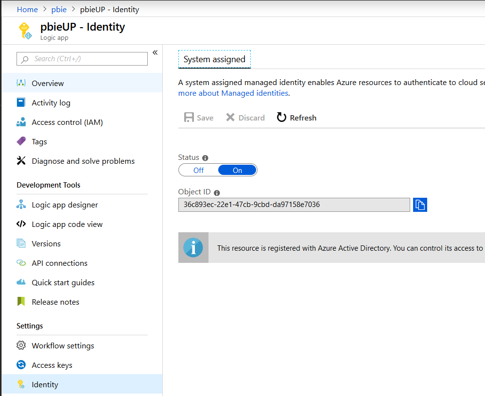
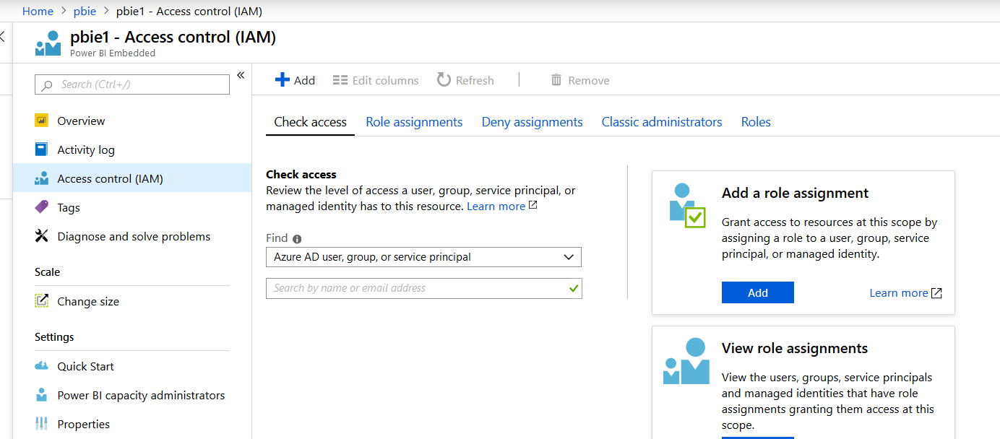
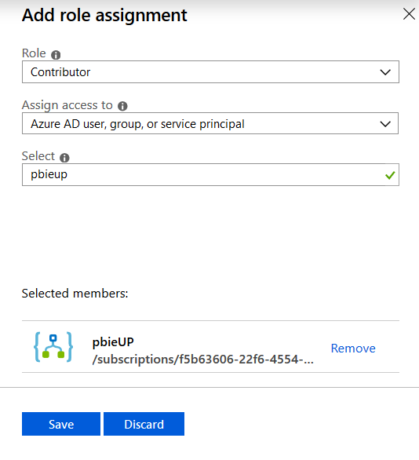
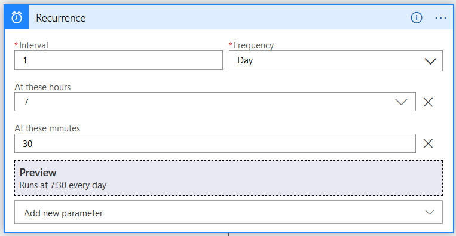
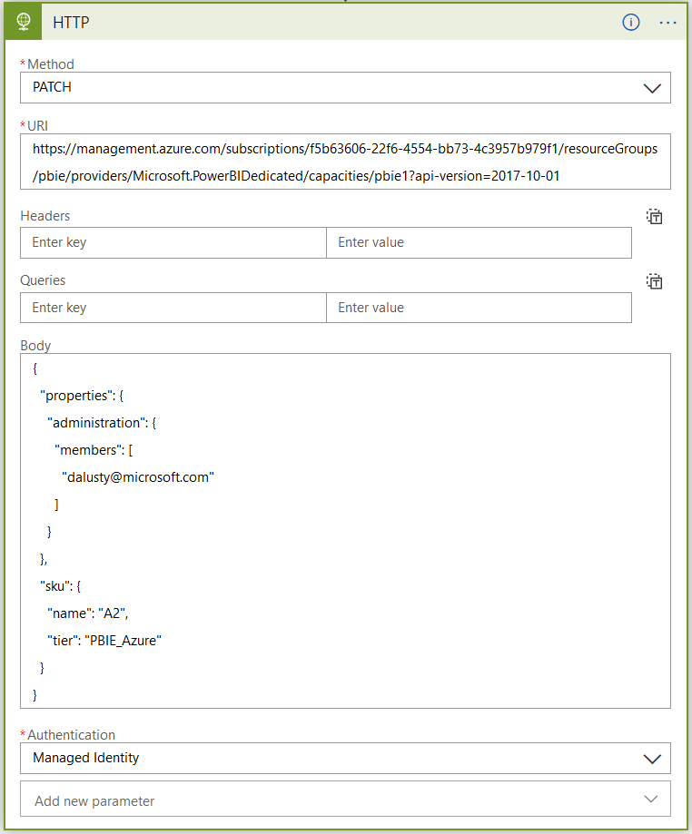

# Scale a Power BI Embedded Instance using Logic Apps
**Produced by Dave Lusty**

# Introduction
In this demo we will configure a Power BI Embedded instance and scale it using Logic Apps. This can be useful for changing scale on a schedule if you know you have busy periods.

# Set up

In the Azure portal, create a Power BI Embedded instance and a blank Logic App. Select A1 for the size of the Power BI Embedded.

In the Logic App interface, go to identity and enable managed identity. This will create an object in Azure AD for the Logic App which we can use to assign permissions.



Now, in the Power BI interface, go to Access Control (IAM) and click Add a role assignment.



In the dialog, select a suitable role to assign - I've used Contributor here but you may wish to be more fine grained.



# Logic App

Now that the Logic App has permissions, go to the Logic App designer and add a recurrence trigger. Here you nbeed to add parameters for hours and minutes to set specific times to run. If you needed the app to run at 7am and 9am select 7 and 9 in the interface. Choose an interval of 1 day.



Next add an HTTP request action. Choose PATCH as the method and enter the URI as below:

```https://management.azure.com/subscriptions/{subscriptionId}/resourceGroups/{resourceGroupName}/providers/Microsoft.PowerBIDedicated/capacities/{dedicatedCapacityName}?api-version=2017-10-01```

Replace the resource group name, dedicated capacity name and subscription ID with your own - you can find all of these in the overview of the Power BI Embedded instance screen. Next, add the following code into the body of the request:

```JSON
{
  "sku": {
    "name": "A2",
    "tier": "PBIE_Azure"
  },
  "properties": {
    "administration": {
      "members": [
        "email@example.com"
      ]
    }
  }
}
```

Change the email to your administrator email. Finally set authentication to Managed Identity and click save, then run to test your app.



You may want to add some logic to test for an HTTP 200 return code and handle any error conditions. This can be seen in the weather app at [https://github.com/davedoesdemos/Quickwins-WeatherData/blob/master/QuickwinsWeatherData.md](https://github.com/davedoesdemos/Quickwins-WeatherData/blob/master/QuickwinsWeatherData.md)

You'll also probably want a second app to scale the system back down at other times of the day.